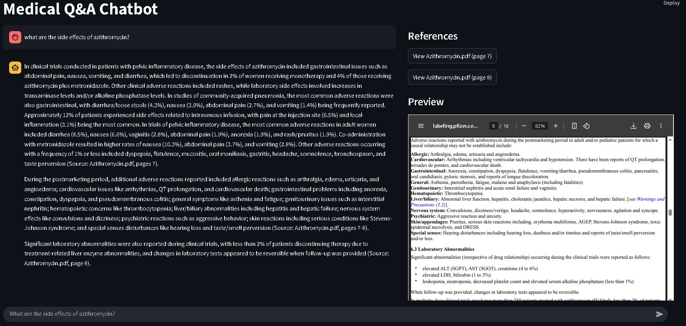

# Q&A Chatbot

An interactive chatbot that answers questions based on your custom documents using retrieval-augmented generation (RAG) and LLMs.

---

##  Project Setup

### 1. Clone the repository
```bash
git clone https://github.com/St-Luciferr/Q-A-Chatbot.git
cd Q-A-Chatbot
```
### 2. Set up a virtual environment
Windows:
```bash
python -m venv .venv
.venv\Scripts\activate
```
Linux/macOS:
```bash
python3 -m venv .venv
source .venv/bin/activate
```
### 3. Install the required dependencies
```bash
pip install -r requirements.txt
```
### 4. Configure environment variables
Copy the example environment config to .env:
```bash
cp .env.example .env
``` 
You need to modify values in .env with your values.

## 📁 Document Setup (Required for chatbot to work)
This project uses local documents as the knowledge base.
### 1. Create a folder named `data/`:
```bash
mkdir data
```
### 2. Place your pdf documents inside the `data/` folder.
⚠️ The `data/` folder is excluded from repository.

## Run Document Ingestion
This will parse the documents and create a searchable vector index:
```bash
python ingest.py
```
This step must be repeated if you add or change documents in the data/ folder.
##  Launch the Chatbot
Start the chatbot interface using Streamlit:
```bash
streamlit run app.py
```
Open the link that appears in your terminal (http://localhost:8501) in a web browser.

## Usage Demo:
The Streamlit-based chat interface presents the conversation history on the left and dynamically displays the reference documents related to the current response on the right, including the ability to preview cited PDF documents directly within the interface.



## Developer Note: 
I developed a context-aware Retrieval-Augmented Generation (RAG) chatbot tailored for interacting with medical documents. The system is designed with a strong emphasis on accuracy, traceability, and factual reliability.

To begin, I used LangChain to orchestrate the pipeline and FAISS as the vector store for its speed, cost-efficiency, and ease of local reproducibility. Medical documents were parsed into overlapping text chunks to preserve context across boundaries. These chunks were then embedded using the **"abhinand/MedEmbed-large-v0.1"** model from Hugging Face, which is specifically fine-tuned for medical-domain semantic understanding.

For each user query, the system retrieves the top-k semantically relevant chunks from FAISS using similarity search. These are injected into a carefully crafted prompt and passed to OpenAI’s GPT model with a low temperature setting to minimize hallucinations and encourage consistency. The prompt directs the model to generate responses strictly grounded in the retrieved content and to include per-paragraph source citations, followed by a summarized reference list.

The frontend was built with Streamlit, providing an intuitive and responsive interface for querying medical knowledge in natural language.
